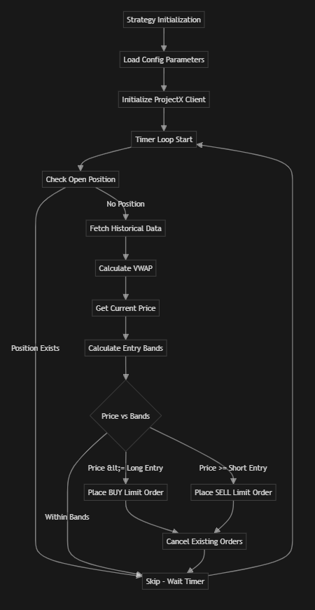

# VWAP-Based Automated Trading Strategy for TopstepX

A minimal viable product (MVP) VWAP-based automated trading strategy using the TopstepX API (`project-x-py`).

## Overview

This strategy calculates Volume Weighted Average Price (VWAP) from historical market data and places limit orders at VWAP deviation bands for Micro Gold Future (MGC) contracts. Orders are placed on a configurable timer, and the strategy maintains only one trade at a time.



## Features

- VWAP calculation from historical market data
- Entry logic at VWAP ± deviation (configurable: 2.0 or 3.0)
- Timer-based order placement (default: every 30 minutes)
- Single position management (one trade at a time)
- Configurable parameters (deviation, timer interval, contract size)

## Prerequisites

1. **TopstepX API Access**: Subscribe to TopstepX API access and obtain your API credentials
2. **Python 3.7+**: Ensure Python is installed on your system
3. **API Credentials**: API key and username from TopstepX

## Installation

1. Install dependencies:
   ```bash
   pip install -r requirements.txt
   ```

2. Set up environment variables:
   - Copy `.env.example` to `.env`
   - Fill in your TopstepX API credentials:
     ```
     PROJECT_X_API_KEY=your_api_key_here
     PROJECT_X_USERNAME=your_username_here
     ```

## Configuration

Edit `config.py` or set environment variables to configure:
- `VWAP_DEVIATION`: Deviation from VWAP for entry points (default: 2.0)
- `TIMER_INTERVAL`: Time interval between order checks in seconds (default: 1800 = 30 minutes)
- `CONTRACT_SIZE`: Number of contracts per trade (default: 1)
- `INSTRUMENT`: Trading instrument symbol (default: 'MGC')

## Usage

Run the strategy:
```bash
python main.py
```

The strategy will:
1. Check for existing open positions
2. Fetch historical market data and calculate VWAP
3. Determine entry points based on VWAP deviation
4. Place limit orders if price conditions are met
5. Repeat on the configured timer interval

Press `Ctrl+C` to stop the strategy gracefully.

## Strategy Logic

- **Long Entry**: Place BUY limit order when current price ≤ VWAP - deviation
- **Short Entry**: Place SELL limit order when current price ≥ VWAP + deviation
- **Position Management**: Only one trade at a time; skips order placement if position exists

## Important Notes

- Test thoroughly in a simulated/paper trading environment before live trading
- Ensure compliance with Topstep's terms of use
- Monitor the strategy and implement appropriate risk management
- API method names may need adjustment based on actual `project-x-py` documentation

## License

This is a sample implementation for educational purposes.

