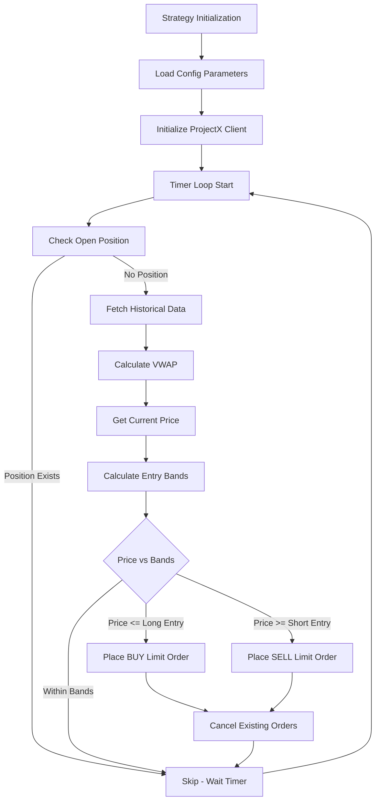

# VWAP-Based Automated Trading Strategy for TopstepX

## Overview

Implement a minimal viable product (MVP) VWAP-based automated trading strategy using the TopstepX API (`project-x-py`). The strategy will calculate VWAP from historical market data, determine entry points at VWAP ± deviation bands, and place limit orders on a configurable timer for Micro Gold Future (MGC) contracts.

## Architecture




## Implementation Plan

### 1. Project Structure Setup

Create the basic project structure:

- `vwap_strategy.py` - Main strategy implementation class
- `config.py` - Configuration parameters
- `main.py` - Entry point and execution script
- `requirements.txt` - Python dependencies
- `.env.example` - Example environment variables template
- `README.md` - Setup and usage instructions

### 2. Core Strategy Implementation (`vwap_strategy.py`)

Create a `VWAPStrategy` class with the following components:**Initialization:**

- Accept configurable parameters: `vwap_deviation` (2.0 or 3.0), `timer_interval` (default 1800 seconds), `contract_size`, `instrument` ('MGC')
- Initialize ProjectX client using environment variables (`PROJECT_X_API_KEY`, `PROJECT_X_USERNAME`)
- Set up logging

**Key Methods:**

- `fetch_market_data()` - Retrieve historical OHLCV data for VWAP calculation
- `calculate_vwap()` - Compute Volume Weighted Average Price from historical data
- `get_current_price()` - Get current market price for MGC
- `has_open_position()` - Check if an open position exists for MGC
- `cancel_all_orders()` - Cancel all pending orders for the instrument
- `place_limit_order()` - Place a limit order (BUY/SELL) at specified price
- `execute_strategy()` - Single iteration of strategy logic
- `run()` - Main execution loop with timer-based scheduling

**Strategy Logic Flow:**

1. Check for existing open position (skip if position exists)
2. Fetch historical market data (sufficient lookback for VWAP calculation)
3. Calculate VWAP from historical data
4. Get current market price
5. Calculate entry bands: `long_entry = VWAP - deviation`, `short_entry = VWAP + deviation`
6. If current price ≤ long_entry: place BUY limit order at long_entry
7. If current price ≥ short_entry: place SELL limit order at short_entry
8. If price within bands: no action
9. Cancel any existing pending orders before placing new orders

### 3. Configuration Management (`config.py`)

Define configuration parameters as constants:

- `VWAP_DEVIATION` - Default 2.0 (configurable to 3.0)
- `TIMER_INTERVAL` - Default 1800 seconds (30 minutes)
- `CONTRACT_SIZE` - Default 1
- `INSTRUMENT` - 'MGC' (Micro Gold Future)
- Optional: Load from environment variables for runtime configuration

### 4. Main Entry Point (`main.py`)

Simple execution script that:

- Loads configuration from `config.py`
- Creates `VWAPStrategy` instance
- Starts the strategy with `run()` method
- Handles keyboard interrupts gracefully

### 5. Dependencies (`requirements.txt`)

Required packages:

- `project-x-py>=1.0.3` - TopstepX API client
- `pandas>=1.5.0` - Data manipulation for VWAP calculation
- `python-dotenv>=1.0.0` - Environment variable management (optional)

### 6. Environment Setup (`.env.example`)

Template file showing required environment variables:

- `PROJECT_X_API_KEY` - TopstepX API key
- `PROJECT_X_USERNAME` - TopstepX username

### 7. Error Handling & Logging

- Comprehensive logging at INFO, WARNING, and ERROR levels
- Try-except blocks around API calls
- Graceful handling of API failures (skip iteration, retry on next cycle)
- Logging of all strategy decisions and order placements

## Key Implementation Details

### VWAP Calculation

- Formula: `VWAP = Σ(Typical Price × Volume) / Σ(Volume)`
- Typical Price: `(High + Low + Close) / 3`
- Use sufficient historical data (e.g., 240 minutes or 1 trading day)

### Order Management

- One trade at a time: Check for open positions before placing new orders
- Cancel all pending orders before placing new limit orders
- Use limit orders at calculated entry prices (VWAP ± deviation)

### API Integration Notes

- Actual API method names may vary - will need to adapt based on `project-x-py` documentation
- Common methods expected: `get_historical_data()`, `get_market_data()`, `place_order()`, `cancel_order()`, `get_positions()`
- API authentication via environment variables

## File Structure

```javascript
vwap_topstepx/
├── vwap_strategy.py      # Core strategy class
├── config.py             # Configuration parameters
├── main.py               # Entry point
├── requirements.txt      # Python dependencies
├── .env.example          # Environment variables template
└── README.md             # Setup instructions
```


## Testing Considerations

- Test with paper trading/simulated environment first
- Verify VWAP calculation accuracy
- Test order placement and cancellation logic
- Validate position checking prevents multiple trades